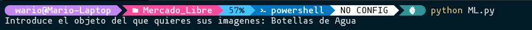
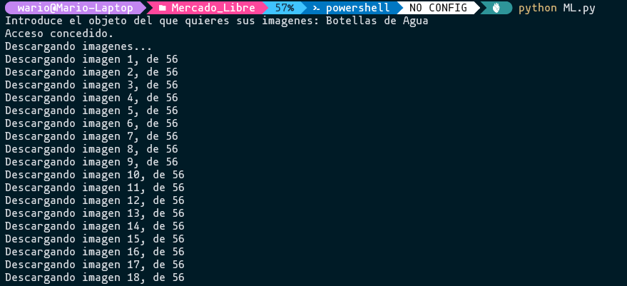
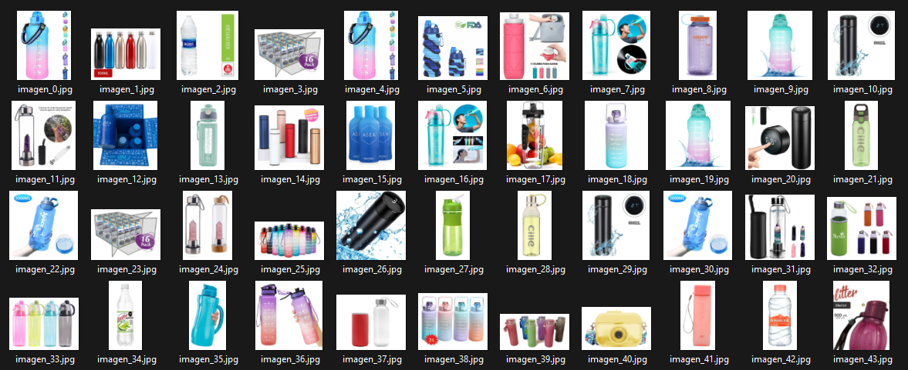

# Recolector de imagenes de Mercado Libre.

Con el pretexto de practicar un poco de web-scrapping a páginas de internet, me propuse como objetivo realizar un script en python, que recolectará imágenes de
productos de Mercado Libre, de modo que el script tiene por input el nombre del objeto a buscar. 
Por ejemplo: __Botellas de agua__. El script recolectará las imágenes de botellas de agua que Mercado Libre despliega en su primera página de resultados, dichas imágenes 
el script las guada en una carpeta del equipo.

## Capturas del script funcionando.

Al ejecutar el programa lo primero que nos encontraremos será lo siguiente.

Tal como en el ejemplo anterior vamos a buscar imagenes de __Botellas de agua__.

Posteriormente el script verica la URL de busqueda y si hay acceso se comienzan a descargar las imagenes

Finalmente al descargar todas las imágenes el script nos abre en automático la carpeta con las imágenes descargadas.

Espero que el script te sea de útilidad y acepto cualquier comentario.
Gracias por tu lectura!

